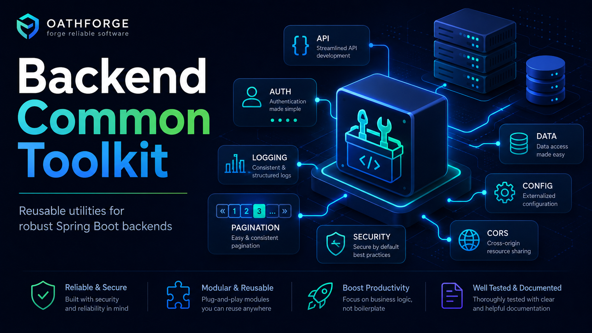

# backend-common-toolkit




### Standalone Java library designed to centralize reusable technical building blocks for Spring Boot backend services.

The library groups together infrastructure components that are frequently repeated across services: consistent HTTP error handling, shared validation, `API-Key` support, encryption utilities, `WebClient` helpers, and public asset URL resolution.

## Purpose

Provide a shared technical foundation without introducing business logic or coupling consumers to a specific domain.

## What it currently includes

- Shared HTTP exception model.
- `ProblemDetail` and centralized error handling for REST APIs.
- Security helpers for `API-Key` authentication.
- Shared CORS configuration activated through properties.
- Optional OpenAPI support activated through properties.
- Optional geospatial utilities activated through properties.
- Shared validation for passwords, UUIDs, uploaded images, and public image URLs.
- Encryption utilities for persisted attributes.
- Shared public asset delivery layer with direct, CloudFront, and Edge Services implementations.
- Simple reusable pagination DTOs.
- Logging utilities for `WebClient` clients.
- A separate JPA module for consumers that need relational support.
- A separate Mongo module for consumers that need Mongo auditing helpers.

## Functional structure

- `exception`: exception hierarchy and standard HTTP response model.
- `security/apikey`: shared support for API key authentication.
- `security/cors`: reusable CORS configuration activated through properties.
- `openapi`: optional OpenAPI configuration.
- `geo`: optional geospatial utilities.
- `validator`: reusable input validation.
- `util`: encryption and general technical utilities.
- `assetdelivery`: public URL resolution and cache invalidation for assets.
- `payload`: pagination DTOs.
- `configuration`: reusable technical configuration helpers.

## Consumption approach

The library is intended to be consumed as a regular Maven dependency, without requiring a private parent POM or a project-specific BOM.

## Basic integration

### Maven dependency

```xml
<dependency>
  <groupId>io.github.oathforge</groupId>
  <artifactId>backend-common-toolkit</artifactId>
  <version>1.1.0</version>
</dependency>
```

### Optional persistence modules

If the project uses JPA/Hibernate and needs base auditing, `TimeOrderedUuid`, or JPA converters, use the separate `backend-common-toolkit-jpa` module.

If the project uses Spring Data MongoDB and needs base auditing or automatic time-ordered ID generation, use `backend-common-toolkit-mongo`.

### Quick examples by area

#### HTTP errors

```java
throw new ResourceNotFoundException("USR0001", "User not found");
```

#### API key

```yml
backend-toolkit:
  security:
    api-key:
      enabled: true
      api-key: change-me
      api-key-username: internal-client
      api-key-authorities:
        - ROLE_READ
        - ROLE_ADMIN
```

With Spring Security on the classpath, the toolkit auto-registers the API key
support from properties alone. Consumer services keep control of their own
`SecurityFilterChain` authorization rules.

#### Shared CORS

```yml
backend-toolkit:
  security:
    cors:
      enabled: true
      allowed-origin-patterns: "https://example.com"
      allowed-methods: "GET,POST"
      allowed-headers: "Content-Type,Authorization"
      allowCredentials: true
      maxAge: 3600
      paths: "/api/**"
```

#### Optional OpenAPI

```yml
backend-toolkit:
  openapi:
    enabled: true
    title: "EcoRastro User Roles API"
    description: "API for user, role, and group management"
    version: "v1"
```

If API key support is also enabled, the toolkit adds the `apiKeyAuth` security
scheme automatically and augments bearer-protected operations so Swagger UI can
authenticate them with bearer or API key.

## Auto-configuration overview

The toolkit publishes Spring Boot auto-configurations through
`META-INF/spring/org.springframework.boot.autoconfigure.AutoConfiguration.imports`.

For Spring Security integration, it also publishes its
`ApiKeyHttpConfigurer` through `META-INF/spring.factories` so the toolkit filter
can be inserted into security chains without consumer-side manual filter wiring.

Currently documented auto-configured blocks:

- `org.oathforge.toolkit.security.apikey.ApiKeySecurityAutoConfiguration`
- `org.oathforge.toolkit.openapi.OpenApiConfiguration`

Practical effect for consumers:

- you configure properties under `backend-toolkit.*`
- the toolkit creates its supporting beans when activation conditions are met
- you should not manually instantiate toolkit API key filters in your service

## Minimal consumer setup

Typical consumer setup with JWT and toolkit API key support:

```java
@Configuration
@EnableMethodSecurity
public class SecurityConfiguration {

  @Bean
  SecurityFilterChain securityFilterChain(HttpSecurity http) throws Exception {
    http
        .csrf(csrf -> csrf.disable())
        .authorizeHttpRequests(authorize -> authorize
            .requestMatchers("/swagger-ui/**", "/v3/api-docs/**").permitAll()
            .requestMatchers("/internal/**").hasAnyRole("READ", "ADMIN")
            .anyRequest().authenticated())
        .oauth2ResourceServer(oauth2 -> oauth2.jwt());

    return http.build();
  }
}
```

The consumer defines endpoint rules, but the toolkit provides the API key beans
and filter automatically when enabled.

## Migration notes

If you are upgrading from older consumer wiring:

- use `backend-toolkit.security.api-key.enabled=true`
- prefer `enabled` over the legacy alias `api-key-enabled`
- keep `backend-toolkit.openapi.enabled=true` for shared OpenAPI setup
- remove manual toolkit `ApiKeyAuthFilter` bean definitions from the consumer
- remove manual `addFilterBefore(...)` registration for the toolkit API key filter

## Troubleshooting

If API key authentication does not activate in a consumer service, verify:

- Spring Security is on the classpath
- `backend-toolkit.security.api-key.enabled=true`
- `backend-toolkit.security.api-key.api-key` is configured with a concrete value
- the service is not overriding toolkit beans unintentionally
- the service `SecurityFilterChain` protects the intended endpoints

If OpenAPI customizations do not appear, verify:

- `backend-toolkit.openapi.enabled=true`
- springdoc/OpenAPI classes are on the classpath
- API key support is also enabled if you expect `apiKeyAuth`

#### Optional geo utilities

```yml
backend-toolkit:
  geo:
    enabled: true
```

#### Password validation

```java
public record ChangePasswordRequest(@ValidPassword String newPassword) {
}
```

#### UUID validation

```java
public record FindUserRequest(@ValidUuid String userId) {
}
```

#### Configurable image validation

```yml
backend-toolkit:
  validation:
    image:
      allowed-extensions: "png,jpeg,jpg"
      allowed-mime-types: "image/png,image/jpeg,image/jpg"
      max-file-size-mb: 5
```

```java
imageFileValidator.isValidImageExtension(file);
imageFileValidator.validateFileSize(file);
imageFileValidator.isValidImageUrl(existingImageUrl);
```

#### Direct encryption

```java
String encrypted = EncryptionUtil.encrypt("my-secret-token", "base-key");
String plain = EncryptionUtil.decrypt(encrypted, "base-key");
```

#### Encryption properties

```yml
backend-toolkit:
  security:
    encryption:
      key: ${APP_ENCRYPTION_KEY}
```

#### Public asset delivery

```java
AssetDelivery delivery = new DirectAssetDelivery(key -> "https://cdn.example.com/" + key);
String publicUrl = delivery.getFileUrlByKey("users/avatar.png");
```

Other included implementations:
- `CloudFrontAssetDelivery`
- `EdgeServicesAssetDelivery`

#### WebClient logging

```java
WebClient client = WebClient.builder()
    .baseUrl("https://partner.example.com")
    .filter(WebClientLoggingFilter.logRequest())
    .filter(WebClientLoggingFilter.logResponse())
    .build();
```

## Detailed documentation

- [Available exceptions and ProblemDetail](docs/exceptions.md)
- [API key security](docs/security-apikey.md)
- [CORS configuration](docs/cors-configuration.md)
- [Optional OpenAPI](docs/openapi.md)
- [Optional geo utilities](docs/geo.md)
- [Shared validation](docs/validation.md)
- [Encryption and conversions](docs/encryption.md)
- [Public asset delivery](docs/asset-delivery.md)
- [Pagination and auxiliary utilities](docs/utilities.md)

## Typical use cases

- Standardize error responses across multiple microservices.
- Reuse filters and internal API key authentication configuration.
- Share password and image validation without duplicating code.
- Reuse trace-level request and response logging for `WebClient` integrations.
- Resolve public file URLs through different delivery providers.
- Reuse backend utilities without dragging in JPA when it is not needed.
